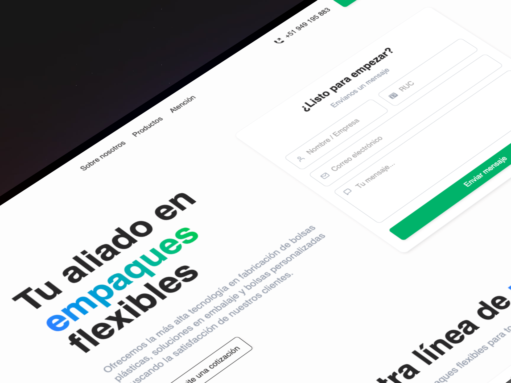

# Plastigesa EIRL - Página Web

Este proyecto fue creado para **Plastigesa EIRL**, una empresa dedicada a la fabricación y comercialización de productos plásticos. La página web fue desarrollada utilizando tecnologías modernas como **Astro**, **Tailwind CSS**, **PNPM**, **React**, y **Framer Motion** para ofrecer una experiencia rápida y eficiente.

Puedes visitar el sitio en [Plastigesa](https://plastigesa.netlify.app/).

<div align="center">
<a href="https://plastigesa.coom/">

</a>
<p></p>
</div>

<div align="center">

## 📚 Tecnologías Utilizadas


[](https://react.dev)
[](https://www.typescriptlang.org)
[](https://tailwindcss.com)
[](https://www.framer.com/motion/)


</div>

## 🚀 Características Principales

- Diseño moderno y atractivo
- Responsive
- Animaciones con Framer Motion
- Carrusel interactivo con Swiper
- Despliegue con Vercel
- Optimizado para SEO y rendimiento

## 🏗 Estructura del Proyecto

El proyecto está organizado de la siguiente manera:

```text
/
├── public/
│   └── favicon.svg
├── src/
│   ├── components/
│   │   └── Card.astro
│   ├── layouts/          # Layouts principales
│   │   └── Layout.astro
│   ├── pages/            # Páginas de la aplicación
│   ├── styles/           # Estilos globales
│   └── utils/            # Funciones utilitarias
├── astro.config.mjs      # Configuración de Astro
├── tsconfig.json         # Configuración de TypeScript
└── package.json          # Dependencias del proyecto
```

Los archivos `.astro` o `.md` en `src/pages/` son las rutas de las páginas.

Los componentes se encuentran en `src/components/`, donde usamos Astro junto Tailwind.

Los recursos estáticos como imágenes están en la carpeta `public/`.`

## 🧞 Comandos

Para ejecutar el proyecto, usa los siguientes comandos desde la raíz:

| Command                    | Action                                                         |
| :------------------------  | :------------------------------------------------------------- |
| `pnpm install`             | Instala las dependencias                                       |
| `pnpm run dev`             | Inicia el servidor de desarrollo en `localhost:4321`           |
| `pnpm run build`           | Construye el sitio para producción en `./dist/`                |
| `pnpm run preview`         | Previsualiza el sitio antes de desplegarlo                     |
| `pnpm run astro ...`       | Ejecuta comandos de la CLI de Astro `astro add`, `astro check` |
| `pnpm run astro -- --help` | Muestra la ayuda de la CLI de Astro                            |
